# Topic 1: Understanding and troubleshooting CrashLoopBackOff errors

A CrashLoopBackOff status in a Kubernetes cluster means that a Container is failing to start, and is therefore being restarted repeatedly. There can be numerous reasons why this might happen. Listed below are some of the most common reasons that may cause this error.


### Understanding POD & Container states

It's helpful to under the POD/Container lifecycle and to see the various states a POD can be under.

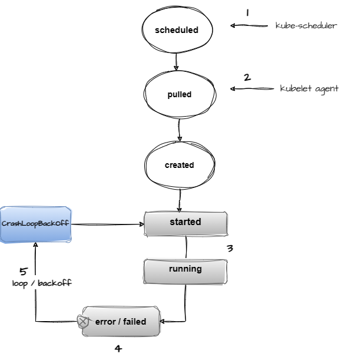

1. The Kubernetes scheduler controller schedules the deployment Pod to be run on specific nodes
2. The Kubelet agent on the node is responsible for pulling the image from the container image registry and creating the Pod instance on the respective node.
3. The POD container starts based on the specific command provided in the deployment specification. The POD starts running after creation
4. After running or during early initialization, an error occurs and the pod goes into an **error** or failed state. 
5. The Kubelet agent attempts to start the container again because the restart policy on a deployment is set to **"Always"**, after looping through a few attempts of this process, the POD goes into a CrashLoopBackOff state, with every subsequent run, the backoff time limit increases up to a maximum of 5 minutes. Note, during this start, run, error, CrashloopBackOff, the container will be in different states.

### Common troubleshooting steps for CrashLoopBackOff

The following flowchart is a guide of how one may start troubleshooting and diagnosing the root cause of a CrashLoopBackOff error.

   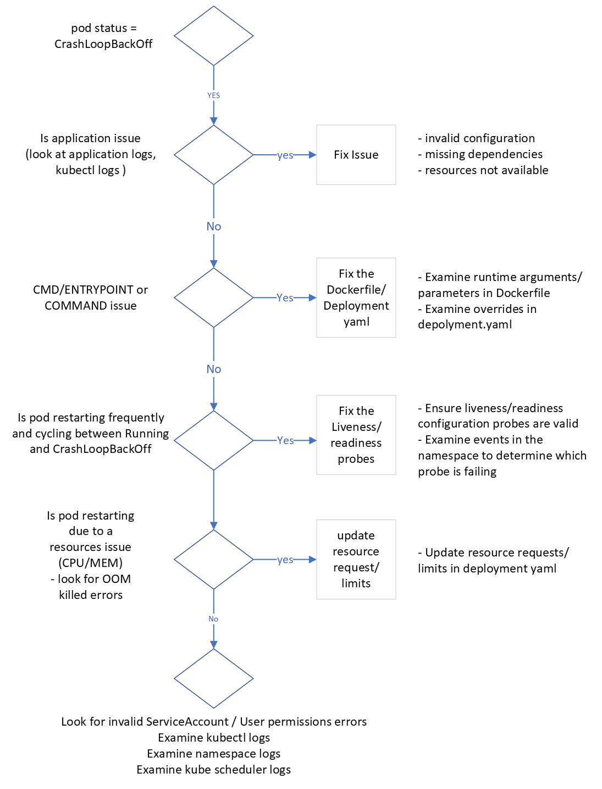

## Common causes of CrashLoopBackOff errors

1 **Application Configuration Errors:**
  - Incorrect command or arguments specified in the container spec. (Dockerfile or deployment.yaml)
  - Invalid application configuration, for example: missing credentials for a backend database or service.

  **Sample 1 - Invalid command** 
  This first example illustrates a startup command override in the deployment yaml that is incorrect, the **"command"** override in the deployment spec is invalid causing the container to o into CrashLoopBackOff 
  ```shell
  kubectl apply -f .\crashloopbackoff\deployments\deployment-bad-cmd.yaml              
  ```
  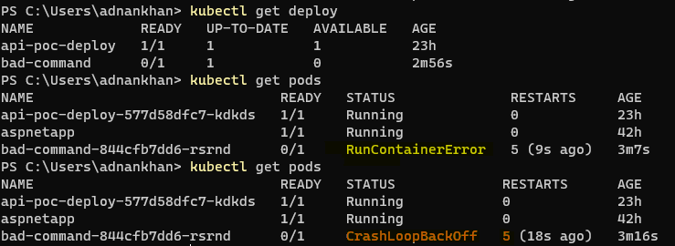

 Use **kubectl describe pod <POD_NAME>>** to get details on failure

  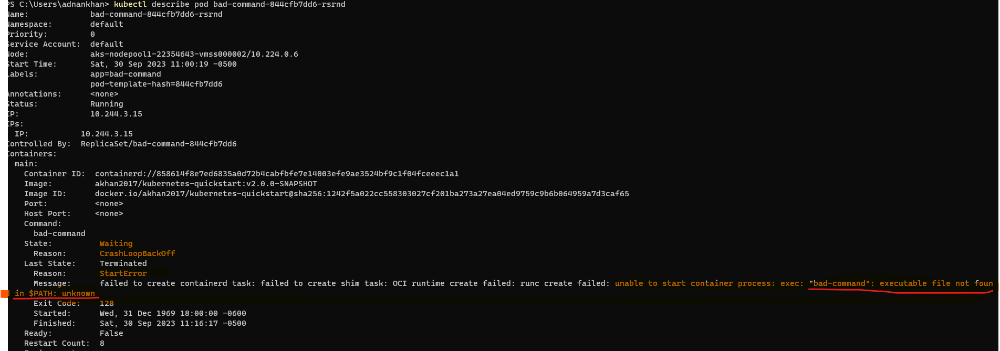

**note** : Always inspect the Dockerfile CMD/Entrypoint and any overrides in the deployment yaml when "Invalid path" command errors are observed in the logs. 

2 **Resource Constraints:**
  - Insufficient CPU or Memory allocated to the pod.
  - Resource Quota Exhaustion: The pod may be attempting to use more resources than allowed or may exceed it's allocated limited causing an Out Of Memory (OOM) exception.

  **Sample 2 - OOM Killed** 
  This deployment sets an upper memory limit on a pod but then starts running commands to consume memory so the limit is exceeded causing the POD to be killed and restarted.
  ```shell
  kubectl apply -f crashloopbackoff/deployments/deployment-oom.yaml
  ```
  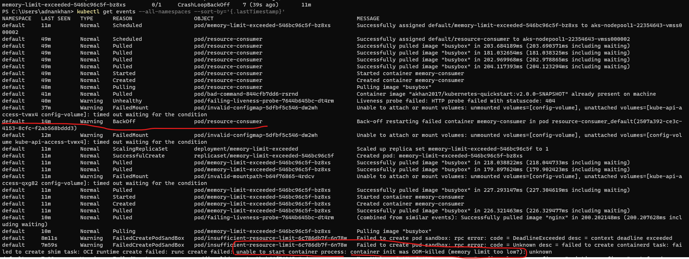

   **note** Look for OOM exceptions and frequently restarting containers, Azure Monitor Log Analytics can be used to monitor and set alerts.    

3 **Application Errors:**
  - Application inside the container is crashing due to errors at startup, this may be due to initializing or dependency injection errors.
  - Application is exiting immediately after startup due to issues like missing dependencies or libraries.

- **Application Dependency Issues:**
  - Required downstream services or endpoints are not accessible or are down, causing the container's process to fail.

  **Sample 3 - Application startup failure**  This example is an application config issue, the application starts and then fails because of a dependency injection failure.
  ```shell
  kubectl apply -f .\crashloopbackoff\deployments\deployment-invalid-app-config.yaml
  ```
  This example is an application config issue, the application starts and then fails because a required dependency injection fails because of an invalid backend resource configuration.

   ```shell
   kubectl apply -f .\crashloopbackoff\deployments\deployment-invalid-app-config.yaml
   ```
   Notice how the POD state moves from **Error** to **CrashLoopBackOff**
   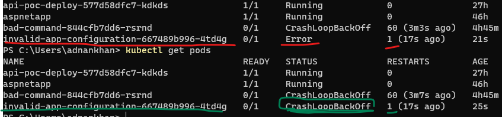

   Notice the application exit code of **1** denoting the application error
   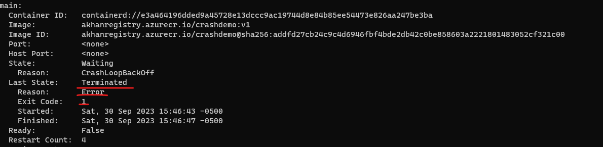

   **kubectl logs <<POD_NAME>>** shows the Java application esception stacktrace shortly after startup
   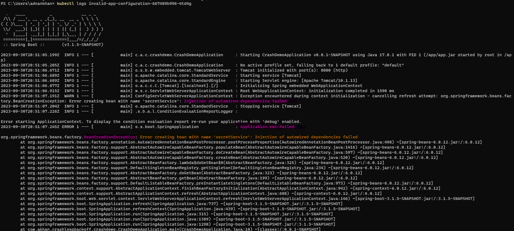

 **note** Most dependency injection frameworks like SpringBoot and .NET will often fail at startup due to object initialization failure and cause CrashLoopBackOff errors.

4 **Permission Issues:**
  - The container is trying to perform actions it does not have permissions for, leading to a failure.
  - An Incorrect Security Context or Service Account is associated with the pod.
 
  **Sample 4 - Application startup failure**  The following sample POD is trying to run the container as a user that does not exist. **runAsUser: 1234**
  ```shell
  kubectl apply -f .\crashloopbackoff\deployments\deployment-invalid-user.yaml
  ```

  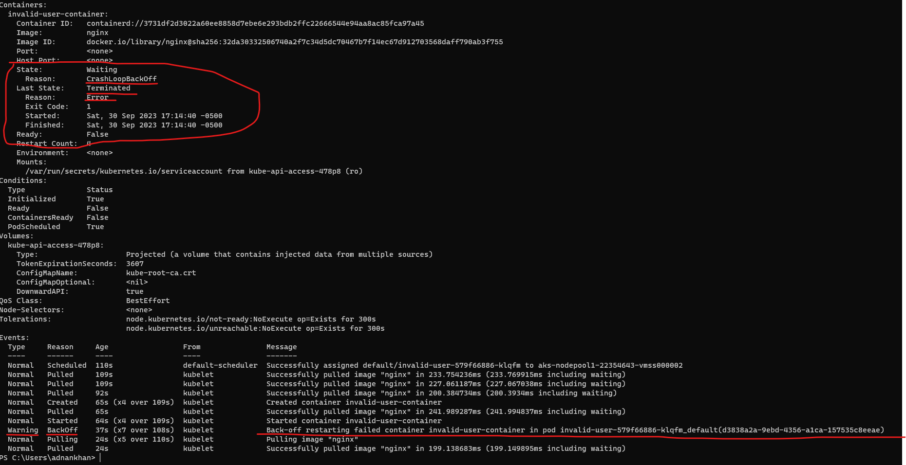

   **kubectl logs** show a user error and Permission denied error
  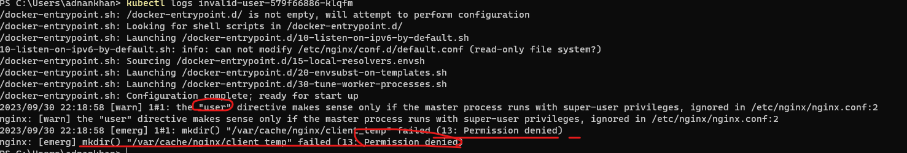

5 **Liveness/Readiness Probes Failure:**
  - Misconfigured or overly aggressive liveness/readiness probes causing the container to be terminated and restarted.

   **Sample 5 - Liveness Probe errors**  The following sample POD is configured with a liveness probe but the probe URI is invalid and results in an 404 not 200 response and thus causes the pod to get restarted.

   ```shell
   kubectl apply -f .\crashloopbackoff\deployments\deployment-failure-probe.yaml 
   ```
  
  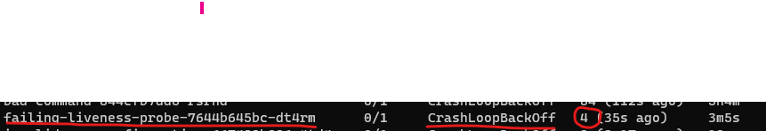
  **kubectl describe pod** clearly shows the Liveness probe failure in the event logs.
  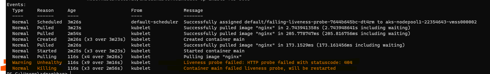
  **Note** The status moves continuously from **Running** to **CrashLoopBackOff**
  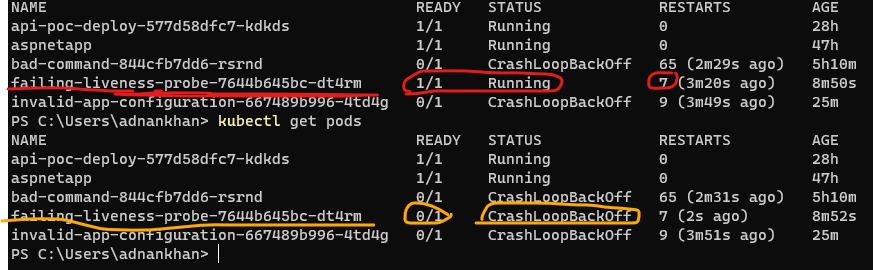

**Note** Pay special attention to certain liveness/readiness probes parameters, these include
- TimeoutSeconds - The default is 1 second which may cause certain probes to timeout
- InitialDelaySeconds - Sometimes a container may need additional time to ramp up and the default may not be applicable, this is especially true for workloads consuming a lot of downstream services line Databases, Message Brokers, etc.

These are other reasons a POD may enter this state, the following can also cause this but unlikely.

- **Node Issues:**
  - Issues with the Node itself, such as disk pressure, could indirectly cause containers to enter `CrashLoopBackOff` status.

- **Quota and Limit Issues:**
  - Exceeding CPU/Memory limits, leading to the termination of containers.
  - Hitting File descriptor limits.


  
