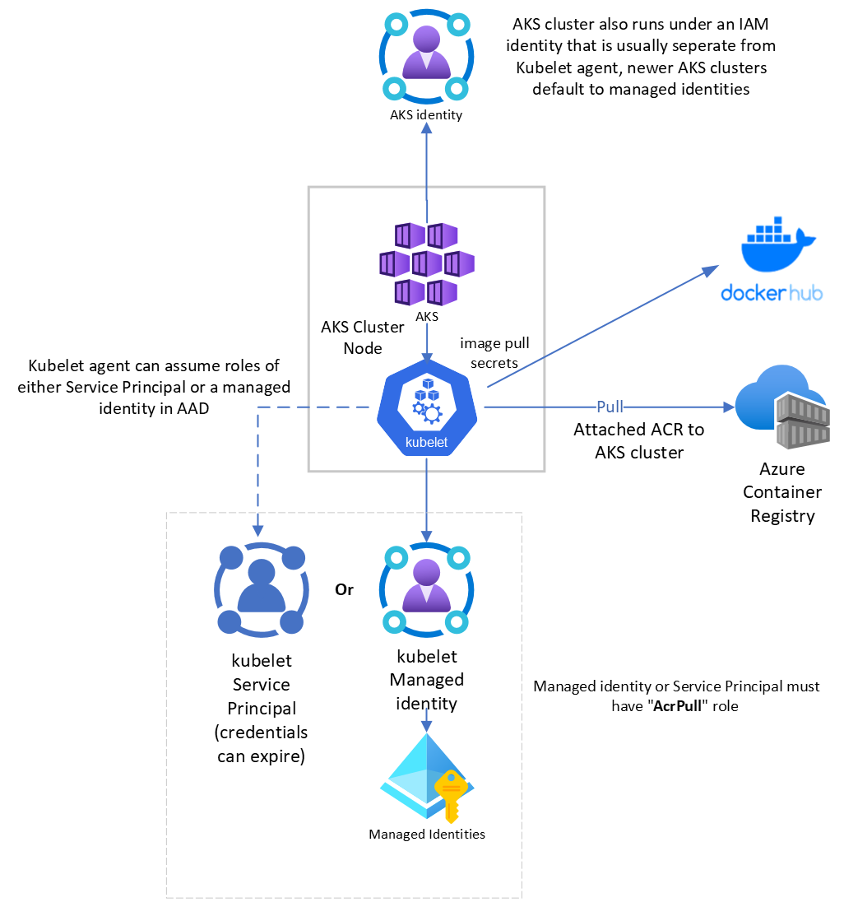
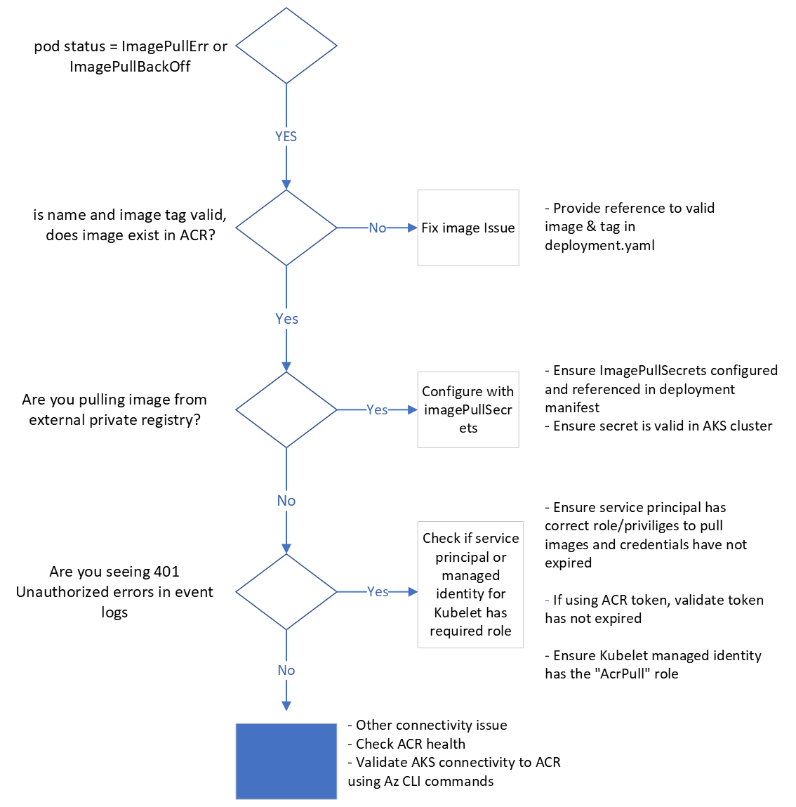
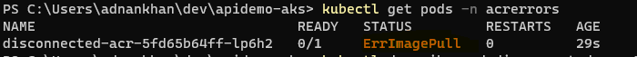
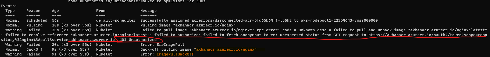
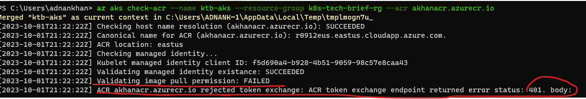
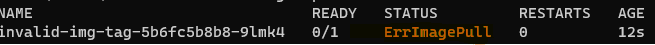
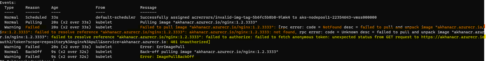
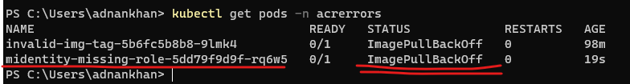
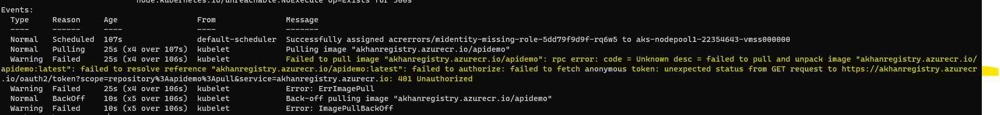
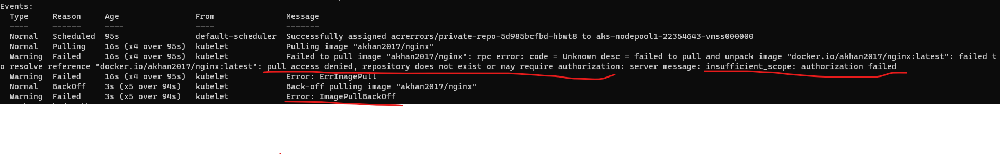

# Azure ACR Access/Authentication Issues with Azure AKS Cluster
Azure Container Registry (ACR) and Azure Kubernetes Service (AKS) integration could face various access/authentication issues, primarily due to misconfigurations, expired credentials, lack of permissions, or network restrictions. Below is a markdown list detailing these potential challenges:

### Understanding AKS, ACR integration and Managed Identities

Newer AKS provisioned clusters use Azure AD Managed identities by default.

   

### Common troubleshooting steps for ErrImagePull errors

The following is a guide to troubleshooting ErrImagePull & ErrImagePullBackOff errors for a deployed POD

   

- **ACR and AKS Configuration:**
  - **Misconfigurations:** Incorrect configuration of ACR or AKS can prevent them from interacting successfully.
 
   #### Test a deployment from an ACR in same subscription but disconnected from the AKS cluster

   ```shell
   kubectl apply -f .\errimagepull\deployment-acr-not-connected.yaml   
   ```
    

    

    The following az cli command is very useful for checking and validating connection configuration between ACR and an AKS cluster.

    ```
   az aks check-acr --name <<AKS_CLUSTER_NAME>> --resource-group <<RESOURCE_GRP_NAME>> --acr <<ACR_ID>>
    ```
    

   The following command can be used to explicitly attach an ACR to an AKS cluster, multiple ACR's can be attached to a single AKS cluster.

   ```
   az aks update -n <<AKS_CLUSTER_NAME>> -g <<RESOURCE_GRP_NAME>> --attach-acr <<ACR_ID>>
   ```

   - **Incorrect Image References:** Incorrect or non-existent image tags and references will lead to failures in pulling images from ACR. The errors can be generic and sometimes misleading.

   #### Test a deployment from a valid ACR but incorrect image tag for an application

   ```shell
   kubectl apply -f .\errimagepull\deployment-acr-invalid-image.yaml   
   ```
   The above command attempts to provide an invalid image tag that does not exist in the repository

   

   kubectl describe pod shows the following events which are somewhat deceiving as it's not really an authorization issue.
   

- **Service Principal Issues:**
  - **Expiration:** Service Principals have an expiration date, post which they are unable to authenticate.
  - **Insufficient Permissions:** If the Service Principal doesn't have adequate permissions to access ACR, it will fail to pull images.
  - **Deletion or Disabling:** Deleted or disabled Service Principals result in authentication failure.
  - **Incorrect Assignment:** Service Principals assigned to the wrong ACR or AKS may face access issues.

- **Managed Identity Issues:**
  - **Scope of Assignment:** Managed Identities may not have the correct scope of assignment, i.e., not assigned at the correct level (Subscription, Resource Group, Resource) to have access to the ACR.
  - **Role Assignment:** Lack of or incorrect role assignment, such as lacking AcrPull (or higher) role, can prevent pulling images.
  - **Misconfigurations:** Incorrectly configured managed identities can lead to access issues between ACR and AKS.

- **RBAC Roles:**
  - **Lack of Appropriate Roles:** Not having appropriate roles assigned, like `AcrPull` to pull images or `AcrPush` to push images, will result in access denial.
  - **Role Assignment Level:** Incorrect level of role assignment (Resource, Resource Group, Subscription) can also lead to issues.
  - **Multiple Roles Conflict:** Having multiple conflicting roles assigned can cause unexpected behavior.

#### Simulate an Access role issue by explicitly removing the **AcrPull** role from the Kubelet's Managed Identity account.

   ```
   az role assignment delete --assignee 617dcb03-43e1-435f-93ac-6fd109cc4a21 --role AcrPull --scope /subscriptions/ae5cd0d7-0de7-46fc-98ed-73428e2bdd5b/resourceGroups/k8s-tech-brief-rg/providers/Microsoft.ContainerRegistry/registries/akhanregistry
   ```

- do the deployment 
``` shell
kubectl apply -f .\errimagepull\deployment-midentity-missing-role.yaml
```

- Observe the results by examining the POD's description (Kubectl describe POD <<pod_name>>)
 
- We observe the events in the POD desciption by doing a Kubectl describe
 
 The ErrImagePull error results in a 401 Unauthorized error message which is expected as the managed identity does not have the right ACR privileges. 

- **Network Policies and Firewalls:**
  - **Network Restrictions:** AKS and ACR may be in different networks or subnets with no access to each other.
  - **Firewall Rules:** Strict firewall rules may block the traffic between AKS and ACR.
  - **Private Link Issues:** Misconfigurations or issues with Private Link setup can prevent access to ACR.

- **External Private Registries:**
  - **Authentication Issues:** Incorrect credentials, token expiry, or other authentication mechanisms can lead to failure in accessing external private registries.
  - **Network Accessibility:** External registries might be unreachable due to network policies, firewalls, or other network-related issues.
  - **Permissions and Roles:** External registries might require specific permissions or roles that, if not configured properly, can prevent access to the required resources.

 #### Try to deploy workload from an external private Docker Hub registry
 ```shell
 kubectl apply -f .\errimagepull\deployment-private-registry.yaml
 ```
 The deployment fails with an ErrImagePull, we see the error in the POD description

 - Observe the results
 

 - To resolve the issue, uncomment the imagePullSecrets section in the deployment.yaml and redeploy.
   ```
      containers:
      - name: main
        imagePullPolicy: Always
        image: akhan2017/nginx
       registry
      imagePullSecrets:
      - name: dockerhubcred
   ```

### Recommended Practices
- Regularly review and renew Service Principals and Managed Identities.
- Assign minimum necessary permissions and regularly audit roles and permissions.
- Properly configure network policies, firewall rules, and Private Links.
- Regularly validate the configuration and access between AKS and ACR.

Remember that resolving access and authentication issues typically involves examining the Kubernetes events and logs, validating the configurations, permissions, and network connectivity, and addressing any identified discrepancies or issues.

### Useful references for ACR authentication issues
[Troubleshoot Registry login](https://learn.microsoft.com/en-us/azure/container-registry/container-registry-troubleshoot-login)

[Troubleshoot ACR network issues](https://learn.microsoft.com/en-us/azure/container-registry/container-registry-troubleshoot-access)

[Monitor ACR (logs & Metrics)](https://learn.microsoft.com/en-us/azure/container-registry/monitor-service)
