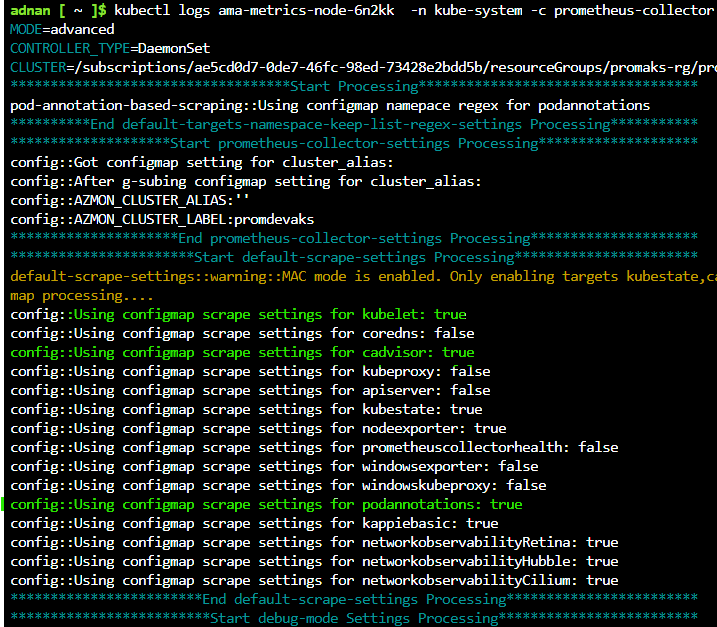
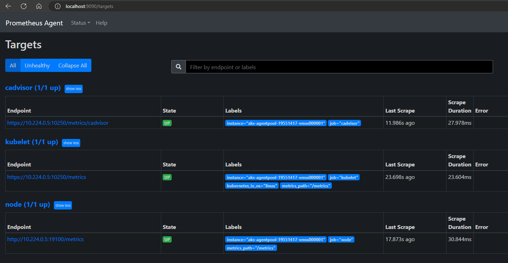

## Scraping metrics from Custom Applications

By default, managed prometheus only scrapes certain core Kubernetes metrics only such as node and other, in order to measure metrics from a specific workload or other core control plane elements, you need to modify the config map for prometheus

## Changes required to support scraping for a specific application/container

1. Modify the application to expose Prometheus metrics via an HTTP endpoint, most popular development runtime support Prometheus client libraries to enable this easily.

2. Modify the deployment.yaml for the application workload and include the required annotations, the following is an example of an application that exposes its metrics at **/actuator/prometheus** endpoint on port 80.

    ```
   annotations:
      prometheus.io/scrape: 'true'
      prometheus.io/path: '/actuator/prometheus'
      prometheus.io/port: '80'
    ```
3. Modify the prometheus config-map **ama-metrics-settings-configmap** to ensure that pod scraping is enabled, it is **disabled** by default, in the following example, we are only scraping pods in the **apps** namespace

    ```
    # Use '.*' to scrape all namespaces of annotated pods.
    pod-annotation-based-scraping: |-
      podannotationnamespaceregex = "apps"
    ```
4. Validate the metrics are being exposed correctly, you can query using the prometheus or grafana explorer

```
   http_server_requests_seconds_count{exception="None",method="GET",outcome="SUCCESS",status="200",uri="/actuator/prometheus"}
```

# Topic 2: Troubleshooting

Follow these steps

1. Run the Azure recommended troubleshooting script and send the output of the script with an azure ticket

    ```
    https://github.com/Azure/prometheus-collector/tree/main/internal/scripts/troubleshoot
    ```
2. Ensure all the Azure Monitor Agent Pods are running. 
  
    ```
    kubectl get pods -n kube-system | grep ama-metrics
    ```
3. Look at the container logs for the Prometheus collector to ensure default scrape targets and custom targets

  ```
    kubectl logs ama-metrics-node-6n2kk  -n kube-system -c prometheus-collector
  ```

  

4. If there are no errors in the logs above, the Prometheus interface can be used for debugging to verify the expected configuration and targets being scraped. If port forward cannot be used, alternatively, you may use curl within the pod or a utility pod to get the details

  ```
    kubectl port-forward <ama-metrics pod> -n kube-system 9090
  ```
    You should be able to see the state of the agent and the specific configurations and targets as shown below

  

## Azure Prometheus Troubleshooting links
- https://learn.microsoft.com/en-us/azure/azure-monitor/containers/prometheus-metrics-troubleshoot


