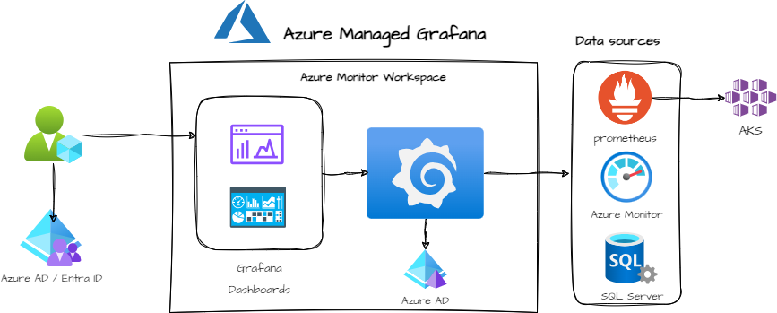

# Topic 1: Azure Managed Grafana

**Azure Managed Grafana** Azure Managed Grafana is a data visualization platform built on top of the Grafana software by Grafana Labs. It's built as a fully managed Azure service operated and supported by Microsoft. Grafana helps you bring together metrics, logs and traces into a single user interface. With its extensive support for data sources and graphing capabilities, you can view and analyze your application and infrastructure telemetry data in real-time.

Azure Managed Grafana is optimized for the Azure environment. It works seamlessly with many Azure services and provides the following integration features:

## Understanding Azure Grafana Architecture

## Core components

### Dashboards

- Provides interactive visualizations and analytics.
Allows for customization and sharing within the organization.
Supports a variety of panels such as graphs, charts, tables, etc. Azure Managed Grafana **creates** default dashboards that can be used out of the box for your AKS clusters

### Data Sources

- Offers integration with various data sources including Azure Monitor, Prometheus, and a number of popular data sources. note: Azure Managed Grafana creates default data sources for managed Prometheus instance as well as some Azure Monitor sata sources.

### Azure AD Integration

- Enables seamless integration with Azure Active Directory for authentication and user management. Supports Single Sign-On (SSO) for a unified access experience across Azure services.
Provides role-based access control (RBAC) for detailed permissions and security.

### Alerting

- Supports alerting on any metric with various notification channels such as email, Slack, webhooks, etc.
Allows the creation of complex alerting rules based on data thresholds or anomalies.
Integrates with Azure Monitor alerts for a comprehensive monitoring solution.

