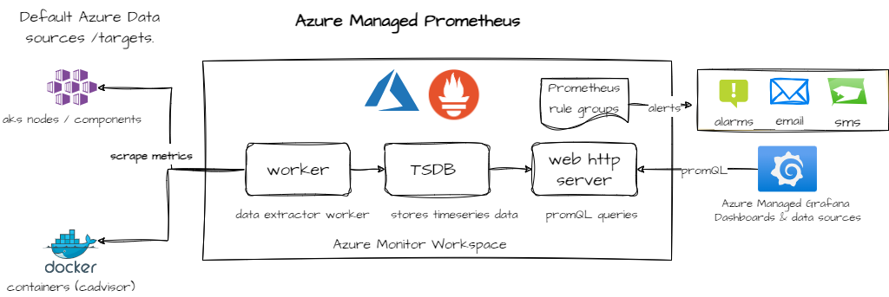

# Topic 1: Azure Managed Prometheus

**Azure Managed Prometheus** is a fully managed Prometheus compatible service from Azure Monitor that delivers the best of what you like about the open-source ecosystem while automating complex tasks such as scaling, high-availability, and 18 months of data retention.


## Understanding Prometheus Architecure in Azure and core components

Prometheus Managed Components in Azure



1. Azure Monitor Workspace: It is a centralized workspace in Azure that collects, analyzes, and visualizes monitoring data from various sources, including Azure resources and external services. Note you cannot use a Azure Monitor Log analytics workspace for Prometheus data.

2. Azure Prometheus Data Sources: These are the data sources that Azure Prometheus connects to in order to collect metrics. It can collect metrics from AKS nodes and critical AKS control plane components as well as workloads/pods deployed in the cluster.

3. Prometheus Time Series Database: This is the database that stores time-series data collected by Prometheus. It allows for efficient querying and analysis of metrics over time.

4. Prometheus HTTP API Server  a server that exposes an HTTP API for querying and retrieving metrics from the Prometheus time series database. It allows users to retrieve metrics data using various query parameters or PromQL.

5. Prometheus workers/data retrievers: Prometheus uses a Pull model, these are the workers responsible for collecting metrics from the configured data sources. They retrieve metrics data at regular intervals and store it in the Prometheus time series database for further analysis and visualization

## Prometheus Metrics and PromQL

1. **Components in a Prometheus Metric**
    - Prometheus metrics are stored in a time series format, which is a sequence of data points taken at successive equally spaced points in time.
    - A Prometheus metric is identified by its name and optional key-value pairs called labels. Using the sample below, "http_requests_total" is the metric name, method/code are the labels (key value) pairs and the 1027 is the metric value at a point in time.
        ```
        http_requests_total{method="GET", code="200"} 1027 1395066363000
        ```
    - Prometheus primarily utilizes an HTTP endpoint to scrape metric data from instrumented services and applications.
    - These metrics are stored locally as aggregated time-series data for capturing events and historical representation.
    - Prometheus supports four types of metrics:
        - **Counter**: A cumulative metric suitable for tracking the number of requests, errors, or completed tasks. It cannot decrease, and must either go up or be reset to zero.
        - **Gauge**: A point-in-time metric that can go both up and down. It is suitable for measuring current memory use and concurrent requests.
        - **Histogram**: Suitable for aggregated measures, including request durations, response sizes, and Apdex scores that measure application performance.

2. **PromQL**
    - PromQL, short for Prometheus Query Language, is a functional query language that allows you to query and aggregate time series data in real time.
    - The result of an expression can either be shown as a graph, viewed as tabular data in Prometheus's expression browser/explorer, or consumed by external systems via the HTTP API.
    - PromQL uses three data types: scalars, range vectors, and instant vectors.

3. **Querying Data Using the Prometheus HTTP API**
    - The Prometheus HTTP query endpoint allows you to run queries and fetch metric data.
    - The API response format is JSON.
    - You can make an HTTP request to the Prometheus server to retrieve the data.
    - For example, you can use a GET request to the `/api/v1/query` endpoint with your query as a parameter.

4. **Sample Prometheus queries**
    - Get avg CPU utilization by cluster node
        ```
       100 - (avg by (instance) (irate(node_cpu_seconds_total{mode="idle"}[5m])) * 100)
    - Get memory usage of each node in cluster as a percentage of total memory available
        ```
           (node_memory_MemTotal_bytes - node_memory_MemAvailable_bytes) / node_memory_MemTotal_bytes * 100
        ```
    - Get counts for a specific URI endpoint for 500 http errors
        ```
       employees_seconds_count{exception="ResourceNotFoundException",method="GET",outcome="SERVER_ERROR",status="500",uri="/employees/{id}",}
        ```


    