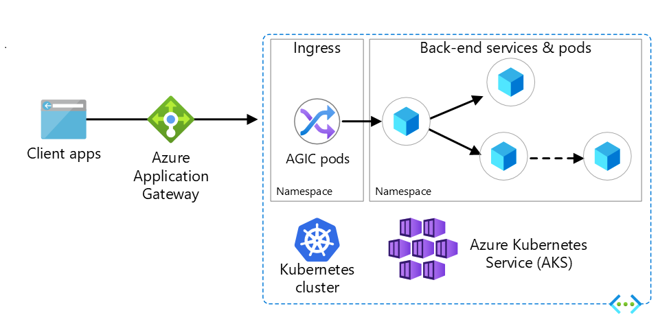

# Topic 1: Azure Application Gateway

**Azure AGIC** The Application Gateway Ingress Controller (AGIC) is a fully managed Kubernetes application and Ingress controller and makes it possible for Azure Kubernetes Service (AKS) customers to leverage Azure's native Application Gateway L7 load-balancer to expose services to the outside. AGIC monitors the Kubernetes cluster for any Ingress resources and continuously updates aa Application Gateway and its corresponding components like backend pools, http settings and health probes.

## Understanding AGIC Architecure and core components

AGIC with AKS integration

## Core components of Azure Application AGIC

### Public IP/Virtual IP (VIP):
-  The Application Gateway requires a public IP address when you host a backend that clients must access over the internet via an internet-facing virtual IP. It supports combinations of private IP and public IP, public IP only, and private IP only.
### Listeners: 
- A listener is a logical entity that checks for incoming connection requests using the port, protocol, host, and IP address. When you configure the listener, you must enter values for these that match the corresponding values in the incoming request on the gateway. AGIC creates two listeners: HTTP on port 80 and HTTPS on port 443.
### Rules: 
- AGIC creates two routing rules: one to redirect the HTTP listener traffic to the HTTPS listener. The HTTPS listener is configured to target your backend on AKS. You can also create custom rules that are evaluated for each request that passes through a policy.
### Backend AGIC Pods: 
- The Application Gateway Ingress Controller (AGIC) is a pod within your Azure Kubernetes Service (AKS) cluster. AGIC monitors the Kubernetes Ingress resources, and creates and applies Application Gateway config based on the status of the Kubernetes cluster.

### AGIC components

