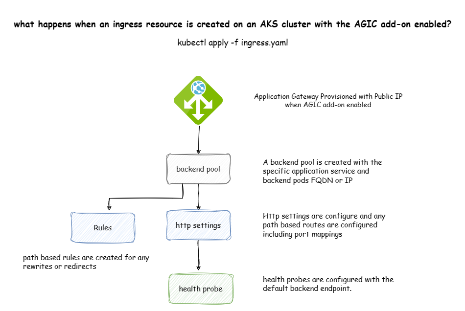

# Topic 2: Understanding AGIC behavior

Its important to understand what happens when the AGIC add-on is enabled and a Kubernetes ingress resource is deployed to the AKS cluster.


## Enabling AGIC add-on on an existing AKS cluster

AGIC with AKS integration

1. Application Gateway is created with an empty backend pool, a default listener, a public IP and a default rule for HTTP ports and default http probes.
2. AGIC pods are deployed on the specific AKS cluster
3. Accessing the public IP of the application gateway will result in Gateway 502 errors since there are no ingress resources configured.

## Deploying an Ingress resource on an AGIC enabled cluster



1. AGIC monitors for Ingress resources and automatically creates the following components
  - A new backend pool with HTTP settings for the required port
  - A new rule based on the Ingress resource definition
  - A new path based rule based on the URI of the ingress, in the ingress below, the AGIC will create a path based rule for /empapi to route to the empapi service on port 80
  - A health probe based on the HTTP settings for the backend resource

## Sample ingress deployments

The following samples can be used to test on an AKS cluster that has AGIC enabled

1. Deploy the official Microsoft sample application for AGIC, this amy also be used for testing purposes. The sample application deploys an aspnet app, service and ingress and serves as the default backend.
    ```
    kubectl apply -f https://raw.githubusercontent.com/Azure/application-gateway-kubernetes-ingress/master/docs/examples/aspnetapp.yaml
    ```
2.  Validate the ingress resource was created
    
    ```
    kubectl get ingress
    ```

3. Deploy a second ingress resource for an application that uses path based routing.

    ```shell
    kubectl apply -f .\agic\sample-path-ingress-deploy.yaml'
    ```


