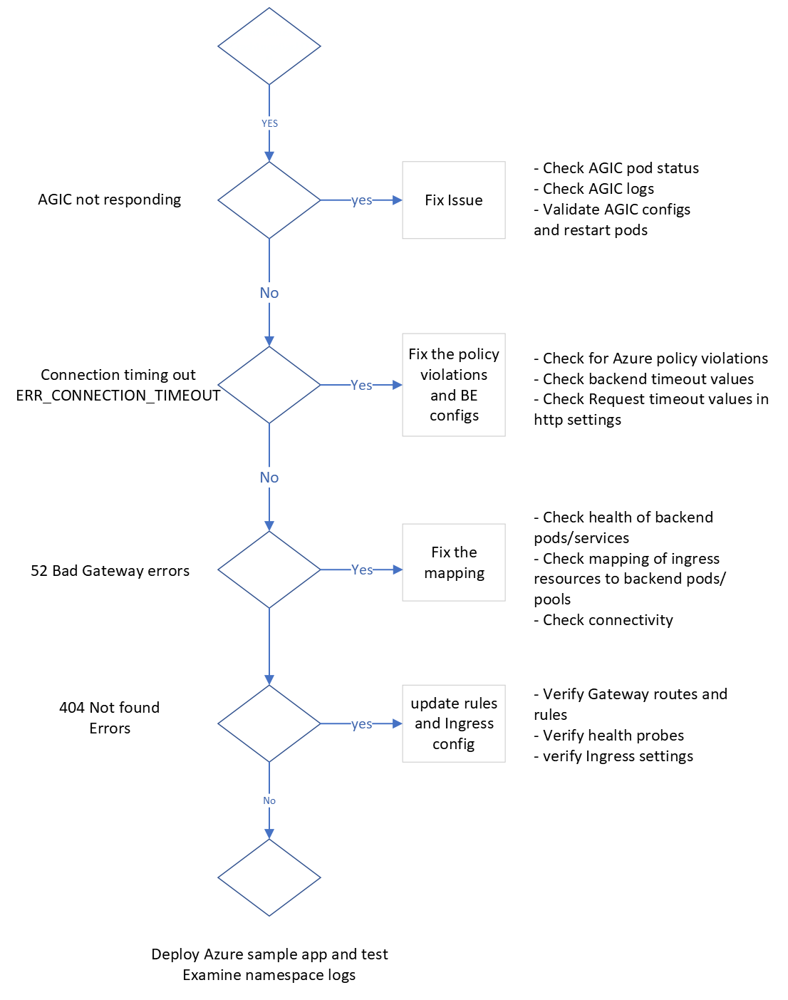

# Topic 3: AGIC Troublehooting flow

## Troubleshooting steps

AGIC with AKS integration

Please refere to the following official documentation also for AGIC troubleshootoing -> https://learn.microsoft.com/en-us/azure/application-gateway/ingress-controller-troubleshoot

