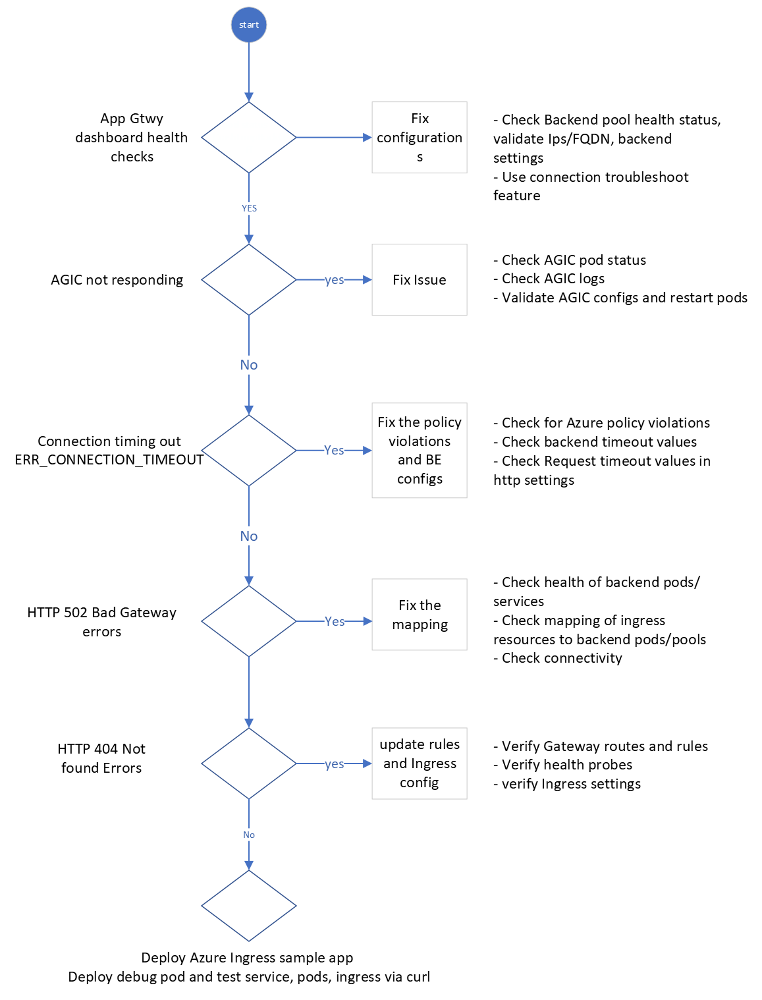

# Topic 3: AGIC Troubleshooting steps

## Troubleshooting Flow

AGIC with AKS integration

Please also refer to the official documentation also for AGIC troubleshooting
-  [Troubleshooting AGIC](https://learn.microsoft.com/en-us/azure/application-gateway/ingress-controller-troubleshoot)

