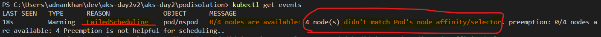

## Troubleshooting POD Scheduling problems

1. Check Pod Status and Events:

    - Use kubectl CLI to check pods to examine if the pod is in a Pending, Running, or error state.
        ```
        kubectl get pods 
        ```
    - Use kubectl describe pod <pod-name> to view events and messages related to scheduling issues.
        ```
        kubectl describe pod <pod_name> -n <namespace>
        ```
    - Examine the events in the cluster namespace to check for scheduling errors
        ```
        kubectl get events -n <namespace>
        ```
        Usually scheduling errors show up as "failed Scheduling" errors as shown below
        


2. Review Taints and Tolerations:

    - Nodes might have taints applied that prevent pods from being scheduled unless the pod has a matching toleration. 
    
3. List taints on your AKS nodes.
    - Ensure your pod specs include the necessary tolerations for the taints present on your target nodes.

        ```
        kubectl get nodes -o custom-columns=NAME:.metadata.name,TAINTS:.spec.taints --no-headers
        ```

5. Check Affinity and Anti-Affinity Rules:

    - Review the pod's affinity and anti-affinity rules to ensure they're not overly restrictive or misconfigured, preventing the pod from being scheduled.
    - Pay special attention to requiredDuringSchedulingIgnoredDuringExecution and preferredDuringSchedulingIgnoredDuringExecution specifications.

6. Inspect Node Selector and Node Affinity:

    - Pods might have node selector or node affinity rules that limit the nodes they can be scheduled on. Verify these rules match the labels of available nodes. For example, the following pod has a node affinity for a node that has label **kubernetes.io/os: linux**
    ```
      nodeAffinity:
          requiredDuringSchedulingIgnoredDuringExecution:
            nodeSelectorTerms:
            - matchExpressions:
              - key: "kubernetes.io/os"
                operator: In
                values:
                - "linux"
    ```
    - Use kubectl get nodes --show-labels to see node labels and ensure they align with your pod's scheduling requirements.


## Azure best practices for advanced scheduling
- https://learn.microsoft.com/en-US/azure/aks/operator-best-practices-advanced-scheduler