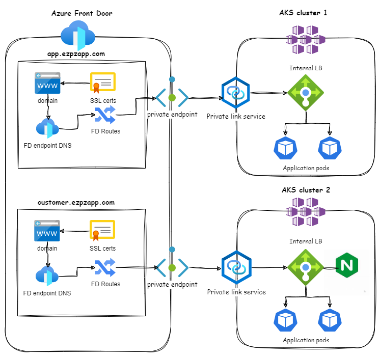

## Azure FD + AKS integration architecture

The below integration illustrates connecting an Front Door (Premium) instance integrating with 2 separate AKS clusters.
- An AKS cluster that exposes a private Load Balancer Kubernetes Service
- A second AKS cluster that uses Nginx ingress controller as a private ingress controller
- Custom domains provisioned with a customer managed TLS cert and managed by unique FD entrypoints.

    

### AFD Public Endpoints: 
- These are the AFD external endpoints that can be used by clients to invoke your downstream services. These endpoints can be configured to custom domains if needed.

### Private Endpoints: 
- These are network interfaces within your virtual network that provide secure connectivity between clients and Private Link services. AFD **automatically** creates the Private endpoint to the AKS Private Link Service when creating the AFD origin group, a request message for approval is sent to the Origin group for approval.

### Private Link Service: 
- This service exposes your internal load balance or ingress controller on AKS to the private endpoint of AFD, effectively bringing it into your virtual network.

### Azure Front Door Origin Groups: 
- Origin Groups in Azure Front Door are a collection of one or more origins (endpoints). These groups allow for high availability scenarios and enable you to group different sets of services that are serving the same content. Azure Front Door uses Origin Groups to decide where to route client requests. If one origin in a group is unavailable, Azure Front Door will automatically failover to the next available origin in the group.

### Routes: 
- In Azure Front Door, routes define the rules for how client requests should be routed to the appropriate Origin Group. Each route specifies the accepted HTTP methods, the pattern to match in the URL path, and the forwarding behavior (like URL rewrite or redirect). This allows you to control and manage traffic distribution to your service endpoints, improving performance and availability. Each routing rule is associated with a particular URL path pattern. When a client makes a request to your custom domain, Azure Front Door matches the URL path of the request against the patterns in your routing rules

### Internal Kubernetes Load Balancer: 
- This L4 LB is used to expose your services within the virtual network and AKS cluster, this is automatically provisioned when creating an internal service or ingress controller.. The load balancer is then linked to the Private Link Service.

### Custom Domain: 
- You can have a custom domain configured in AFD which is used to access your application. When you configure a custom domain on Azure Front Door, you also define a set of routing rules for that domain. These routing rules are essentially the instructions that tell Azure Front Door how to route traffic for that domain. Custom domain will map to the AFD Entrypoints.

### Customer Managed SSL/TLS Certificate: 
- This is used in AFD for securing the custom domain. The certificate helps in establishing an encrypted link between AFD and the client.

### Domain Mapping: 
- The root of your custom domain is mapped to the Kubernetes cluster, allowing the application to be accessed via the custom domain.

