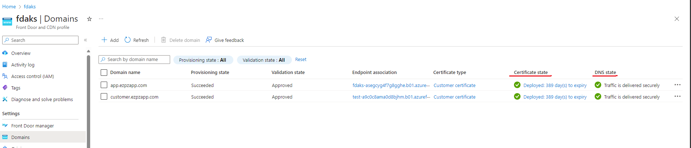

## Azure FD + AKS integration Troubleshooting

The following flow chart serves as a starting point for troubleshooting AFD integration with AKS


1. Validate that the pods are running and the ClusterIP service is properly configured to the pods

```
   kubectl get pods
   kubectl get svc
   kubectl get endpoints
```

2. Validate that the ingress controller pods are running, ensure the logs are not showing any errors

```
   kubectl logs <ingress_contoller_pod>
   kubectl get ingress -n <namespace>
   kubectl describe ingress -n <namespace>
```

3. If the AKS cluster ingress or LB endpoint is private, ensure that the Private Link Service has a valid connection to the Azure Front Door (AFD) private endpoint. This can be by viewing the Private Link Center to validate connections, furthermore you can look at the insights view for the Private Link Service to ensure the components are wired together correctly.

    
    

4. Examine the AFD routing rules to the backend origin pool (AKS cluster), ensure that the HTTP/HTTPS SSL configurations are valid, if the backend is only using HTTP then this needs to be configured accordingly.

5. If using custom domains, ensure that the domain has been setup and wired correctly. Ensure a valid SSL is used and that the DNS for the custom domain resolves correctly to the Front Door Entrypoint.

    

```
   nslookup <custom-domain>
```   


  